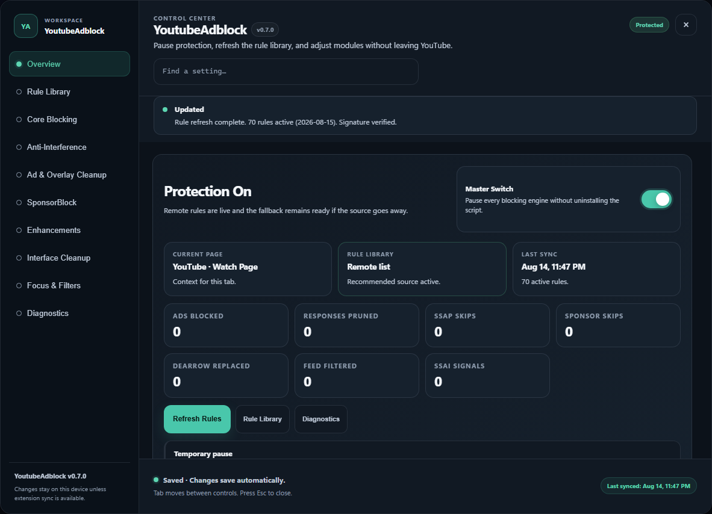

# YoutubeAdblock


> A document-start YouTube ad blocker with a split-context proxy engine, remote rule support, and a premium Control Center for tuning protection.

Desktop validation snapshot (2026-08-13): deterministic userscript/generated-extension fixtures pass on main YouTube dark/light/wide layouts, Music, TV, and Kids; an isolated live unpacked extension on Playwright Chromium 149 loaded its packaged DNR ruleset, rejected a real `google.com/pagead` probe with `net::ERR_BLOCKED_BY_CLIENT`, and showed 9 recent matches across 4 packaged rules in Diagnostics. See [`RESEARCH.md`](RESEARCH.md) for the evidence boundary and remaining real-ad/account matrix.

## Quick Start

### Userscript (Tampermonkey / Violentmonkey)

1. Install [Tampermonkey](https://www.tampermonkey.net/) or [Violentmonkey](https://violentmonkey.github.io/)
2. [Click here to install YoutubeAdblock](https://github.com/SysAdminDoc/YoutubeAdblock/raw/refs/heads/main/YoutubeAdblock.user.js)
3. Confirm installation when prompted, then reload YouTube
4. Open your userscript menu and use the built-in commands to open the Control Center, pause or resume protection, or refresh rules on demand

#### Chrome: extra steps your manager now requires

Chromium browsers gate userscripts behind a per-browser switch, and Tampermonkey 5.5.0 (2026-05-08) added its own injection permission on top of it. If YouTube loads but the Control Center never appears, work through these in order:

1. **Enable the browser's userscript switch.** On Chrome 138 and newer, open `chrome://extensions`, click your userscript manager, and turn on **Allow User Scripts**. (Older builds exposed this as Developer mode instead.) Without it the manager is installed but cannot inject anything.
2. **Grant Tampermonkey's injection permission.** Tampermonkey 5.5.0+ prompts for a dedicated extension permission the first time it injects a script — accept it. Saving or updating a script can also raise a separate download-permission prompt; that one covers this script's rule refreshes.
3. **Violentmonkey on MV3 Chromium:** if the script loads *late* (ads appear on the first video after a cold start, then stop working correctly on later ones), open Violentmonkey's settings and enable the experimental **Alternative page mode**, which restores reliable `document-start` timing. Violentmonkey 2.46.0–2.47.1 (2026-07-29 → 2026-08-13) leaves it off by default.
4. **Check the diagnostic.** The Control Center's Diagnostics section reports injection timing and will tell you whether the manager started late rather than leaving you to guess from ad behavior.

> **Coming from uBlock Origin?** Manifest V2 extensions stopped running in Chrome 138 (July 2025), and the Chrome Web Store removes the remaining MV2 listings on **2026-08-31**. On Chromium, full-strength blocking now means uBO Lite, another MV3 blocker, or a userscript-based one like this. This project is a YouTube-only blocker — it does not replace a general-purpose content blocker, and it is free with no premium tier or paid feature gate.

### Chrome / Edge / Brave (Chromium 121+, MV3 extension, unpacked)

1. Clone or download the repo, then run `powershell -ExecutionPolicy Bypass -File .\Build-Extension.ps1` to regenerate [extension/main.js](extension/main.js) from the userscript
2. Visit `chrome://extensions`, enable **Developer mode**, and click **Load unpacked**
3. Select the [extension/](extension/) folder
4. Click the YoutubeAdblock toolbar button to open the Control Center

Optional browser shortcuts can be bound from `chrome://extensions/shortcuts`; no global shortcut is assigned by default.

Because the MV3 manifest intentionally includes both `background.service_worker` and `background.scripts` for Chrome + Firefox compatibility, the unpacked extension target is Chromium 121 or newer.

For the safe local release gate, run `npm ci` once, then run `powershell -NoProfile -ExecutionPolicy Bypass -File .\Build-Release.ps1`. It regenerates the extension, runs syntax/tests and the browser matrix, validates DNR and signed data, verifies the unpacked ZIP, writes SHA-256 checksums, cleans stale artifacts, and produces the current `.user.js` plus `.zip` in `dist/`. CRX packaging is intentionally opt-in because the repository pins an existing Chromium extension ID but does not commit its private key. Only a maintainer holding that matching key should add `-Artifacts Userscript,Zip,Crx -CrxKeyPath <private-key.pem>` or call `Build-CRX.ps1 -KeyPath <private-key.pem>`; the tools refuse to generate a replacement identity. Chrome generally does **not** allow ordinary local-file CRX installs outside managed or supported self-hosted flows, so **Load unpacked** remains the desktop default.

### Firefox (MV3 extension)

**Persistent install:** This repo does not publish a signed XPI yet. Firefox requires AMO or `web-ext sign` signing for persistent extension installs, so the persistent Firefox path today is the userscript install with Tampermonkey or Violentmonkey.

**Temporary install (development):**

1. Build the extension as above
2. Visit `about:debugging#/runtime/this-firefox`
3. Click **Load Temporary Add-on** and pick [extension/manifest.json](extension/manifest.json)
4. Click the YoutubeAdblock toolbar button to open the Control Center

### Other platforms (not validated in this desktop pass)

#### Safari (iOS / macOS, via Userscripts app)

1. Install [Userscripts](https://github.com/quoid/userscripts) from the App Store (free, open-source)
2. Enable the Userscripts Safari extension in Settings → Safari → Extensions
3. Open the Userscripts editor, tap **+**, and paste the raw URL: `https://github.com/SysAdminDoc/YoutubeAdblock/raw/refs/heads/main/YoutubeAdblock.user.js`
4. Reload YouTube — the script runs the same engine as Tampermonkey/Violentmonkey

> **Note:** Safari support is community-tested, not officially validated. DeArrow, volume boost, and other features relying on Web Audio or advanced GM_* APIs may behave differently. Report issues with your Safari version.

#### Firefox for Android

1. Install [Firefox for Android](https://play.google.com/store/apps/details?id=org.mozilla.firefox) (supports extensions since Dec 2023)
2. Install [Tampermonkey](https://addons.mozilla.org/en-US/android/addon/tampermonkey/) or [Violentmonkey](https://addons.mozilla.org/en-US/android/addon/violentmonkey/) from AMO
3. Navigate to the [raw userscript](https://github.com/SysAdminDoc/YoutubeAdblock/raw/refs/heads/main/YoutubeAdblock.user.js) and confirm the install
4. Open YouTube — this is currently the only mainstream mobile path for full YouTube ad blocking in a browser

The extension ships the same blocking engine as the userscript plus **declarativeNetRequest rules** that block ad-serving endpoints (`/pagead/`, `/api/stats/ads`, `/youtubei/v1/player/ad_break`, googlevideo `ctier=SA` segments, DoubleClick, Google Syndication, Google Ad Services, and `google.com/pagead/*` from YouTube origins) at the browser network layer — outside the reach of page-level anti-adblock code. When browser DNR is unavailable, the userscript fetch/XHR engine also short-circuits ad-exclusive requests locally and scrubs text DASH/HLS manifests that reference googlevideo `ctier=SA` or `ctier=SR` ad segments.

Release builds ship a least-privilege manifest: no `tabs` permission (matching host permissions already expose `tab.url` for YouTube tabs) and no `declarativeNetRequestFeedback`, which Chrome documents for unpacked-extension debugging and which now lives in the development-only `extension/manifest.dev.json` profile. In a production build the Browser Network Layer card in Diagnostics reports that the evidence is unavailable while blocking continues normally. With the development profile loaded unpacked, that card reads the requesting YouTube tab's recent packaged-rule IDs, counts, and last-match time; it does not expose request URLs, raw browser errors, or unrelated tabs, and it never writes match evidence to extension storage.
If you trigger the extension while you are not already on YouTube, YoutubeAdblock opens a YouTube tab and carries the action forward there automatically.

## Highlights

- Blocks ads before they render by pruning payloads in `JSON.parse`, `fetch()`, and `XMLHttpRequest`
- Handles anti-detection paths like abnormality callbacks, clean iframe bypasses, and playback timers
- Keeps cosmetic cleanup separate from payload blocking so the interface stays tidy after the heavy lifting is done
- Ships with a local fallback rule set, cached remote rules, and a diagnostics-friendly Control Center

## Features

| Feature | Description | Default |
|---------|-------------|---------|
| JSON.parse Proxy | Strips ad payloads from YouTube API responses at the data level | Enabled |
| Fetch Proxy | Intercepts `/youtubei/v1/player`, `/browse`, `/search`, `/next` and prunes ad fields | Enabled |
| XHR Proxy | Catches XMLHttpRequest-based ad delivery channels | Enabled |
| Ad-Only Request Guard | Answers known DoubleClick, Google pagead, and YouTube ad-exclusive fetch/XHR URLs locally so those requests never leave the page | Enabled |
| appendChild Proxy | Blocks ad-related script and iframe injection into the DOM | Enabled |
| setTimeout Proxy | Neutralizes timed ad triggers and delayed ad insertion | Enabled |
| Promise.then Proxy | Intercepts promise-chained ad delivery pipelines | Enabled |
| Property Traps | Prevents YouTube from reading/writing ad-related player properties | Enabled |
| CSS Cosmetic Filters | 150+ selectors hiding ad containers, banners, and promotions | Enabled |
| SSAP Auto-Skip | Automatically clicks the skip button on skippable video ads | Enabled |
| SSAI Signal Warning | Measures PlayerResponse `serverStitchedAd` signals, shows a Control Center warning when ads are stitched into the media stream, and includes the last signal in diagnostics | Enabled |
| Anti-Detect Bypass | Defeats YouTube's abnormality/adblock detection system | Enabled |
| Iframe Fetch-Lift Defense | Rebridges `contentWindow.fetch`, `XMLHttpRequest`, and `JSON.parse` in same-origin iframes so YouTube can't lift pristine globals | Enabled |
| Aggressive Anti-Stall | Fast-forwards 17-second bound timers YouTube uses to stall playback when a blocker is suspected | Enabled |
| Video Ad Fast-Forward | Mutes and accelerates any ad that slips past pruning (last-resort safety net) | Enabled |
| SponsorBlock Auto-Skip | Silently skips sponsor, self-promo, intro, outro, interaction, preview, music-off-topic, and filler segments using the privacy-preserving SponsorBlock hash-prefix API. Requires one-time consent in the Control Center before any request is made; skip view-reports are a separate opt-in | Consent-gated |
| toString Proxy Mask | Patches `Function.prototype.toString` so every hooked native still reports `[native code]` to YouTube's detection paths | Enabled |
| ServiceWorker Block | Proxies `navigator.serviceWorker.register` / `getRegistration{s}` so YouTube can't install a worker that bypasses the request proxies | Enabled |
| Webpack Chunk Prune | Rewrites ad-rendering factory modules inside `self.webpackChunk_youtube_player.push` before they execute, using a built-in signature set that refreshes from [`webpack-ad-signatures.json`](webpack-ad-signatures.json) | Enabled |
| DASH/HLS Manifest Scrub | Removes googlevideo `ctier=SA`/`ctier=SR` ad segment references from text DASH/HLS manifests as a playback-layer fallback when browser DNR is unavailable | Enabled |
| No-Ad Request Signal | Injects `isInlinePlaybackNoAd` into outbound `/player`, `/get_watch`, and YouTube TV `/tenx_player` request bodies via fetch, XHR, and an `Object.assign` hook that survives YouTube's locker script | Enabled |
| Engine Health Monitor | Tracks per-engine install success and surfaces degraded-protection warnings in the Control Center when YouTube's locker script or a competing blocker locks a native | Enabled |
| DeArrow Titles & Thumbnails | Replaces clickbait titles and thumbnails with crowd-submitted alternatives via the privacy-preserving DeArrow hash-prefix API *(userscript only — extension build pending API permission)*. Requires one-time consent in the Control Center | Consent-gated |
| Return YouTube Dislike | Restores the public dislike count under the like button. Sends full video IDs to returnyoutubedislikeapi.com, so it requires one-time consent in the Control Center | Consent-gated |
| Force Original Audio | Switches back to the original-language audio track when YouTube defaults to an auto-dubbed or translated track | Optional |
| Volume Boost | Web Audio gain stage up to 5x with an inline slider in the player controls | Optional |
| Clutter-Free Mode | Eight Unhook-style toggles: home feed, Shorts shelves, Shorts tab, related videos, comments, end-screen cards, live chat, merch shelves | Optional |
| Channel + Keyword Blocklist | Strips videos whose channel or title matches local blocklists. Channel entries support names, `UC...` IDs, `@handles`, channel URLs, regex, JSON/plain-text import-export, and BlockTube/FilterTube-style migration import. `/regex/` entries use a bounded safe subset (max 256 chars, 500 entries per list, no backreferences or lookarounds, and a quantified group may not contain another quantifier or alternation); rejected lines show a line-specific error in the editor instead of silently matching as text | Optional |
| Shorts → /watch Redirect | Rewrites `/shorts/VIDEO_ID` to the full watch player | Optional |
| DNR Network Blocking *(extension only)* | Blocks `/pagead/*`, `/api/stats/ads`, `/api/stats/atr`, `/pcs/activeview`, `/youtubei/v1/player/ad_break`, selected tracking posts, googlevideo ad-tier media, DoubleClick, Google Syndication, Google Ad Services, and `google.com/pagead/*` for YouTube initiators. DNR output is generated from the same typed source that validates userscript intercept metadata | Enabled |
| DNR Match Evidence *(extension only)* | Reports five-minute packaged-rule IDs and counts for the current YouTube tab in Diagnostics, with no request URLs or persisted history | Available |
| Remote Filter List | Fetches and applies uBO-compatible filter lists from a configurable URL | Enabled |
| Control Center | Desktop section rail, searchable settings, protection overview, quick actions, module toggles, rule refresh, blocklist editors, diagnostics, recovery tools, and explicit save/sync status | Enabled |
| Extension Settings Sync | MV3 builds mirror toggles, blocklists, allowlists, and thresholds through `chrome.storage.sync`; oversized blocklists stay local instead of failing saves | Enabled |
| Live Stats | Real-time counters for blocked, pruned, SSAP skipped, sponsor skipped, DeArrow replaced, and feed filtered | Enabled |
| TrustedHTML Hardened | User-controlled text uses DOM/text APIs and guarded helpers; a full Trusted Types enforcement audit remains on the roadmap | Always |

## How It Works

```
┌──────────────────────────────────────────────────────────────────────┐
│                        document-start                                │
│                                                                      │
│  ┌─────────────────────┐    ┌──────────────────────────────────┐    │
│  │  PHASE 1: Page Ctx  │    │  PHASE 2: Sandbox                │    │
│  │  (injected <script>)│    │  (Tampermonkey GM_* APIs)        │    │
│  │                     │    │                                  │    │
│  │  • JSON.parse proxy │    │  • 150+ CSS cosmetic selectors   │    │
│  │  • fetch() proxy    │    │  • DOM MutationObserver cleanup  │    │
│  │  • XHR proxy        │    │  • SSAP auto-skip delegation     │    │
│  │  • appendChild proxy│    │  • GM_getValue/setValue storage   │    │
│  │  • setTimeout proxy │    │  • Remote filter list fetching   │    │
│  │  • Promise.then     │    │  • CSS re-injection protection   │    │
│  │  • Property traps   │    │  • Control Center UI             │    │
│  │  • Video ad skipper │    │                                  │    │
│  └─────────────────────┘    └──────────────────────────────────┘    │
│              │                            │                          │
│              ▼                            ▼                          │
│     Real window object            Shared DOM access                  │
│     (YouTube sees proxies)        (CSS/elements work from sandbox)   │
└──────────────────────────────────────────────────────────────────────┘
```

Tampermonkey's `@grant GM_*` directives wrap userscripts in a sandbox where `window` is a proxy — YouTube's scripts never see modifications made in the sandbox. YoutubeAdblock solves this by injecting the proxy engine into the **real page context** via a `<script>` element at `document-start`, before any YouTube scripts execute. CSS injection, DOM observers, and settings management stay in the sandbox since they operate on the shared DOM.

Each proxy installation is individually try/catch wrapped using a `safeOverride()` helper (direct assign → `Object.defineProperty` → delete+redefine fallback), so one engine failure never prevents the others from loading.

## Configuration

All settings persist via `GM_setValue`. Open the userscript menu and choose `YoutubeAdblock: Open Control Center` to adjust protection without leaving YouTube.

### Control Center



The v0.5.23 Control Center keeps the selected ImageGen-led desktop shell and adds the tested Browser Network Layer evidence state shown above. The screenshot is the generated-extension implementation, not a standalone mockup.

| Setting | Description | Default |
|---------|-------------|---------|
| Overview | Live status, active source, current desktop surface, metrics, and quick actions | Available |
| Section Navigation | Persistent rail for Rule Library, blocking, cleanup, SponsorBlock, enhancements, filters, and diagnostics | Available |
| Master Switch | Enable or pause every blocking engine without uninstalling the script | On |
| Rule Library | Choose a compatible raw list and refresh it on demand; the recommended source is the safest default for extension installs | [youtube-adblock-filters.txt](https://raw.githubusercontent.com/SysAdminDoc/YoutubeAdblock/refs/heads/main/youtube-adblock-filters.txt) |
| Core Blocking | Control JSON pruning, fetch/XHR interception, property traps, and request rewriting | On |
| Anti-Interference | Control abnormality bypass, iframe defense, SSAP skipping, spoofing, and timer neutralization | On |
| Ad & Overlay Cleanup | Control video-ad fallbacks, cosmetic cleanup, upsell blocking, and Shorts ad removal | On |
| SponsorBlock | Skip community-identified sponsor segments with hash-prefix lookups and explicit service status | Optional |
| Enhancements | Configure DeArrow, RYD, original audio, and the desktop volume boost control | Optional |
| Interface Cleanup | Hide selected feeds, shelves, comments, chat, merchandise, and other desktop clutter | Optional |
| Focus & Filters | Configure Shorts redirect, channel/keyword filtering, whitelist mode, duration limits, creator ad exceptions, and import/export | Off |
| Diagnostics | Inspect extension packaged-rule matches, copy a privacy-scrubbed snapshot, reset counters, or restore recommended defaults | Available |
| Compliance Dialog Safety | Detects YouTube age/identity verification prompts and exempts them from cosmetic hiding, breakage detection, and any automatic dismissal — they are reported in Diagnostics instead | Always on |
| Settings Import | Import a settings JSON export with schema-version checks, full field validation, a confirmable add/change/clear preview, all-or-nothing apply, and one-click undo | Available |

### Filter List

The default remote filter list is hosted in this repo at [`youtube-adblock-filters.txt`](https://raw.githubusercontent.com/SysAdminDoc/YoutubeAdblock/refs/heads/main/youtube-adblock-filters.txt). It uses uBO-compatible filter syntax and is verified against the bundled Ed25519 public key before it replaces active rules. The userscript build can point the Rule Library field at any compatible raw list URL; custom sources are allowed but shown as unsigned in diagnostics. The extension build works best with sources that allow direct browser fetches from YouTube pages, so the recommended GitHub-hosted source is the safest default there. If a refresh fails or signature verification fails, YoutubeAdblock keeps the last working rules or the built-in fallback active so protection does not drop unexpectedly.

### Pruned API Fields

The proxy engine strips these fields from YouTube API responses before they reach the player:

`adPlacements` · `adSlots` · `playerAds` · `adBreakHeartbeatParams` · `auxiliaryUi.messageRenderers.upsellDialogRenderer` · `responseContext.adSignalsInfo` · `frameworkUpdates`

### Intercepted Endpoints

`/youtubei/v1/player` · `/youtubei/v1/get_watch` · `/youtubei/v1/tenx_player` · `/youtubei/v1/browse` · `/youtubei/v1/search` · `/youtubei/v1/next` · `/youtubei/v1/guide` · `/watch?`

## Supported Sites and Current Validation

| Site | URL | 2026-08-13 status |
|------|-----|-----|
| YouTube | `https://www.youtube.com/*` | Live shell/network recon + fixture matrix + unpacked-extension watch smoke |
| YouTube Mobile | `https://m.youtube.com/*` | Compatibility retained; outside this desktop pass |
| YouTube Music | `https://music.youtube.com/*` | Live shell/network recon + fixture matrix |
| YouTube TV | `https://tv.youtube.com/*` | Live shell/network recon + fixture matrix; `tenx_player` and TV ad tray covered |
| YouTube No-Cookie | `https://www.youtube-nocookie.com/*` | Fixture coverage; direct no-referrer embed returned Error 153, so live playback still needs a host page |
| YouTube Kids | `https://youtubekids.com/*`, `https://www.youtubekids.com/*` | Public setup shell + fixture matrix; playback awaits disposable parental setup |

## FAQ / Troubleshooting

**Ads still showing after install?**
Make sure no other YouTube ad-blocker userscripts are running simultaneously — they can conflict with the proxy engine. Disable competing scripts and reload.

**Diagnostics says YoutubeAdblock loaded late?**
Chrome MV3 userscript managers can miss `document-start` unless user scripts are explicitly allowed. Open `chrome://extensions`, select Tampermonkey or Violentmonkey, enable **Allow User Scripts** if Chrome shows it, confirm the script is enabled for YouTube, then reload YouTube. If Diagnostics says document-start is confirmed but ads still show, use **Refresh Rules** instead of reinstalling.

**YouTube detects my ad blocker?**
Ensure the Anti-Detect setting is enabled. If YouTube recently changed their detection, check for a script update or open an issue.

**Works on Firefox?**
The source and fixture contracts cover Firefox-compatible paths, but this pass did not run a real Firefox userscript manager. Use Violentmonkey or Tampermonkey and report the manager/browser versions with copied diagnostics if document-start health is degraded.

**How do I use a different filter list?**
Point the Rule Library field at a compatible raw list that includes the selectors you want, then refresh the rules from the Control Center.

**How do I reset settings?**
Open the Control Center and use `Restore Defaults`. That resets the master switch and feature toggles to the recommended starting state without requiring DevTools.

## Contributing

Issues and PRs welcome. When reporting bugs, include:

- Browser and version
- Userscript manager and version
- The **Copy Diagnostics** output (extension reports include packaged DNR rule IDs/counts, never request URLs)
- Console errors (F12 → Console, filter by `YoutubeAdblock`)
- Which settings are enabled

## License

[MIT](LICENSE) — Matthew Parker
