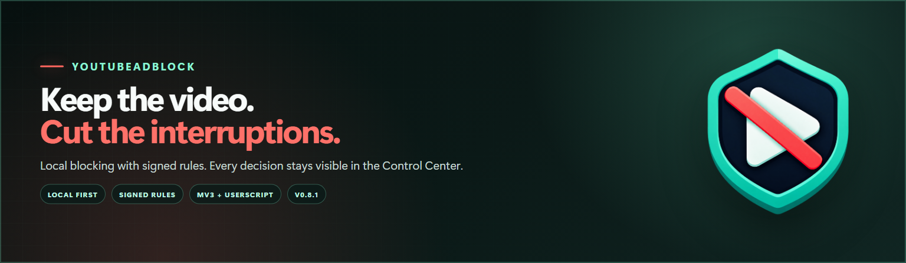
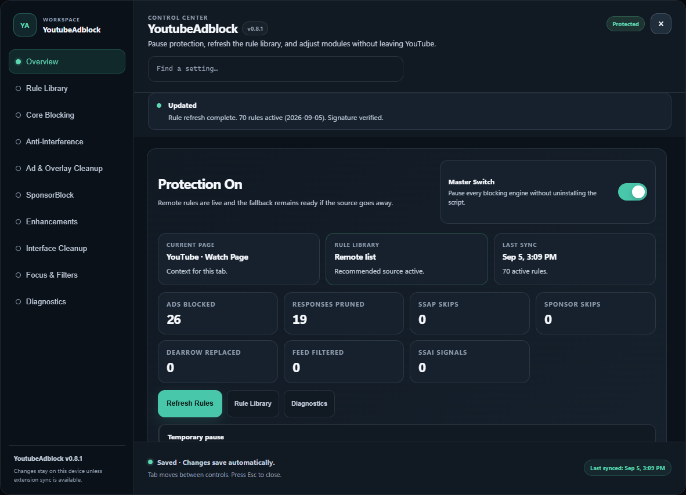
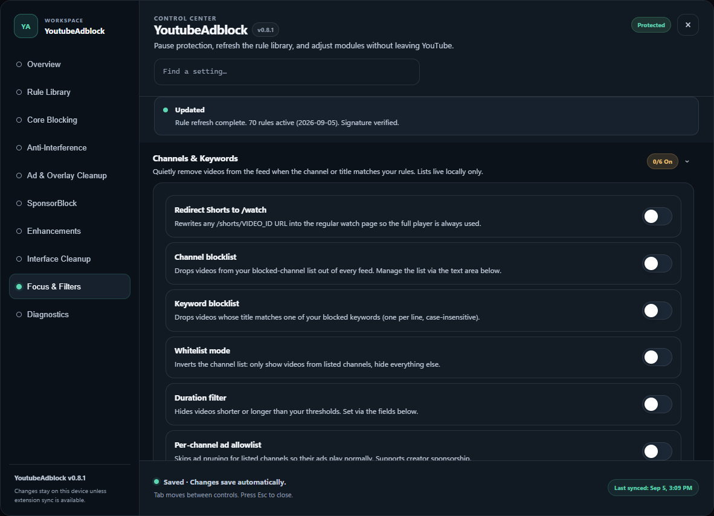
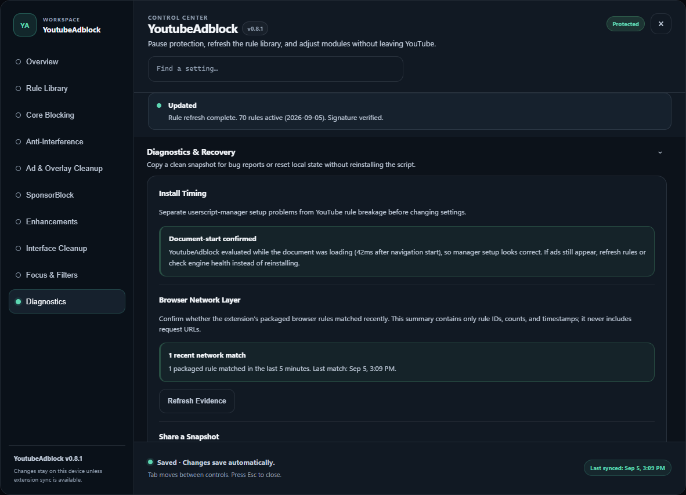
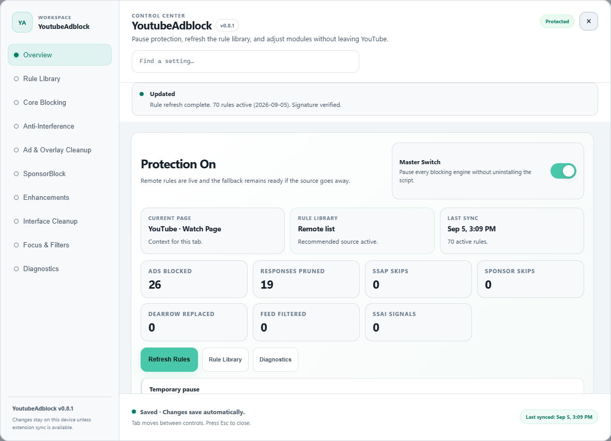

# YoutubeAdblock

[](https://github.com/SysAdminDoc/YoutubeAdblock/releases/latest)
[](LICENSE)

[](https://github.com/SysAdminDoc/YoutubeAdblock/raw/refs/heads/main/YoutubeAdblock.user.js)



YoutubeAdblock is a local YouTube blocker with two install paths: a userscript for the quickest setup, and an unpacked MV3 extension with browser-level network rules. Both builds include the same in-page Control Center, so protection never feels like a black box.

[Install the userscript](https://github.com/SysAdminDoc/YoutubeAdblock/raw/refs/heads/main/YoutubeAdblock.user.js) · [Download the latest release](https://github.com/SysAdminDoc/YoutubeAdblock/releases/latest) · [Report a breakage](https://github.com/SysAdminDoc/YoutubeAdblock/issues/new)

## Why use it

- Blocks known ad requests locally, then prunes ad fields before the player reads them.
- The Control Center shows active rules, engine health, recent counters, and recovery controls.
- Recommended rules and webpack signatures are verified with Ed25519. A built-in fallback stays ready.
- Community services remain off until you allow each one. Settings and diagnostics are designed to avoid browsing-history leaks.

No blocker can promise permanent coverage against a service that changes every week. YoutubeAdblock gives you clear evidence, a quick pause, and enough diagnostics to tell a setup problem from a changed YouTube response.

## Product tour

These are product captures, not mockups. The capture command loads the unpacked extension in a private headless browser profile, serves a local YouTube fixture, refreshes the signed rules, and exercises the real blocking engine.

### See protection at a glance



The counters above came from the same deterministic capture run: 26 blocked requests and 19 pruned responses. They aren't seeded totals.

### Quiet the feed as well as the ads



Redirect Shorts, filter channels or keywords, set duration limits, and keep selected creators on an ad allowlist. These controls start off.

### Check the browser layer without exposing URLs



This image uses the unpacked development profile, which adds Chrome's diagnostic permission. The capture fires a real `pagead` probe and waits for a packaged-rule match. Production builds use the same DNR rules but omit that permission, so the card reports that evidence is unavailable instead of asking for broader access.

<details>
<summary>View the light theme</summary>



</details>

## Install

### Userscript

This is the easiest route for Chrome, Edge, Brave, and Firefox.

1. Install [Tampermonkey](https://www.tampermonkey.net/) or [Violentmonkey](https://violentmonkey.github.io/).
2. Open the [raw YoutubeAdblock userscript](https://github.com/SysAdminDoc/YoutubeAdblock/raw/refs/heads/main/YoutubeAdblock.user.js).
3. Confirm the install, then reload YouTube.
4. Open YoutubeAdblock from your userscript manager's menu.

If a Chromium browser says the manager can't inject scripts, open its extension details and enable **Allow User Scripts**. The Control Center's Install Timing card will flag a late start instead of making you guess.

### Chromium extension

The extension adds packaged `declarativeNetRequest` rules. Chrome, Edge, and Brave 121 or newer are supported.

1. Download `YoutubeAdblock-extension-v0.8.1.zip` from the [latest release](https://github.com/SysAdminDoc/YoutubeAdblock/releases/latest).
2. Extract the ZIP to a folder you plan to keep.
3. Open your browser's extensions page, enable Developer mode, and choose **Load unpacked**.
4. Select the extracted folder. Click the new shield icon to open the Control Center.

The ZIP is the normal Chromium artifact. A CRX is published only when the maintainer's stable-ID signing key is available. Generating a new key would change the extension identity and disconnect existing local storage.

### Firefox

The userscript is the recommended persistent install today. You can also build the MV3 extension and load `extension/manifest.json` temporarily from `about:debugging#/runtime/this-firefox`.

This repo does not publish a signed XPI yet. Firefox requires AMO or `web-ext sign` signing for a persistent extension. A temporary install disappears when the browser closes.

## What it handles

| Area | What YoutubeAdblock does |
|---|---|
| Player responses | Removes known ad fields from JSON, fetch, and XHR responses before player code uses them. |
| Ad-only requests | Answers tightly scoped ad endpoints locally. The extension adds packaged network rules for YouTube ad paths and known ad hosts. |
| Playback fallback | Mutes and advances a video ad that survives earlier layers. Text DASH and HLS manifests get a bounded ad-segment scrub. |
| Page cleanup | Hides ad containers and selected upsells. Age and identity checks are marked as compliance dialogs and left alone. |
| Focus tools | Optional channel, keyword, duration, Shorts, feed, comment, chat, and merchandise controls live in one panel. |
| Community features | SponsorBlock, Return YouTube Dislike, and userscript-only DeArrow support are consent-gated per service. |
| Recovery | Pause for five minutes, thirty minutes, or the current tab without changing the saved master switch. |
| Portability | Export settings, preview an import diff, apply it atomically, and undo the last import in the same session. |

## Privacy and trust

- The recommended Rule Library and webpack signature database are signed. A failed refresh keeps the last working copy or built-in rules.
- SponsorBlock, Return YouTube Dislike, and DeArrow make no request until that service is allowed in the Control Center.
- Extension diagnostics return bounded rule IDs, counts, and timestamps. They don't return request URLs or save match history.
- User preferences can sync through extension storage. Counters, caches, consent, and anti-rollback state stay on the current device.

Custom Rule Library URLs are allowed in the userscript. Their content is parsed through a restricted filter subset, and the UI labels them as unsigned.

## Current validation

The local suite covers the userscript and generated extension across dark, light, and wide desktop YouTube fixtures. It also covers Music, TV, Kids, settings sync, signed updates, privacy gates, blocklist safety, and release artifact structure.

`npm run screenshots:marketing` loads the actual unpacked extension headlessly. Its development pass proves that a packaged DNR rule rejects a `google.com/pagead` image probe and that the Control Center reports the match without a URL.

Safari and mobile browser paths haven't been exercised in this v0.8.1 release. Firefox-compatible code and fixtures are tested, but a real Firefox userscript-manager session isn't part of the current desktop gate.

## Build and verify

```powershell
npm ci
npm test
powershell -NoProfile -ExecutionPolicy Bypass -File .\Build-Release.ps1
```

The release gate regenerates `extension/main.js`, runs the browser matrix and contract tests, checks signed data, and cleans old output. It writes SHA-256 checksums plus the userscript, unpacked-extension ZIP, and provenance file to `dist/`.

Brand and screenshot assets are reproducible too:

```powershell
npm run assets:marketing
npm run screenshots:marketing
```

See [extension/README.md](extension/README.md) for extension internals and signing notes.

## Reporting a problem

Open the Control Center, go to Diagnostics, and use **Copy Diagnostics**. Include that text with the browser version, userscript manager if applicable, and the page type that failed. The snapshot removes video IDs and request URLs.

Please don't post signed-in page HTML, cookies, or a full browser profile.

## License

[MIT](LICENSE) © Matthew Parker
